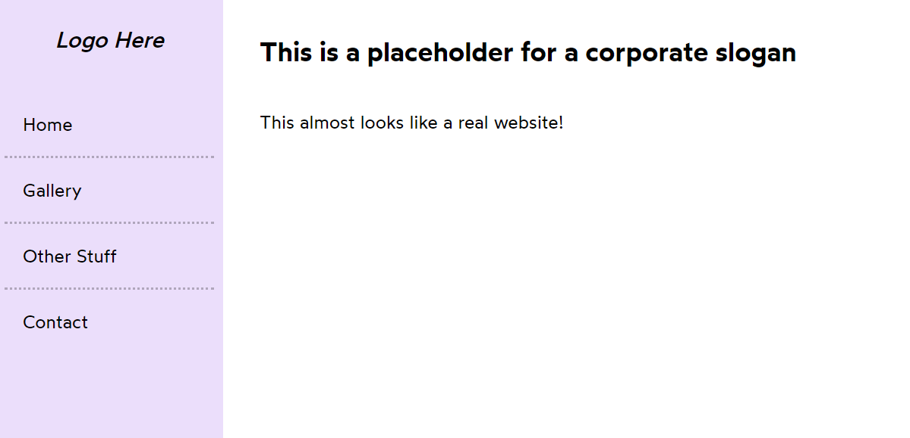

# Component API Design : Redesigning the Component Based on Best Practices

## Example : Banner Component

#### Restructure the Banner Component: Separate Logic and UI

Refactor the Banner component to segregate the business logic responsible for the login process from the user interface design.

## Example : Product Component

Divide the entire Product component into smaller, modular parts to enhance readability and maintainability.

## Example : Product Cart Component

Apply Dynamic CSS Styling to Product Cart Component

Implement CSS styles dynamically within the Product Cart component to ensure adaptability and responsiveness.

# Props Delegation

## Example : Slider Component

Use of delegation as a property inside the Slider component

In React components, utilizing object destructuring and spreading (...) props allows for concise and flexible handling of component props. This pattern is particularly useful when you want to delegate or pass through props dynamically without explicitly declaring each prop in the component's prop list.

## Example : Toggle Component

Use of delegation as a property inside the Toggle component

<h1> ForwardRef </h1>

## Example : Slider Component

## Example : Hover Button

## Example : Slider Square

# Polymorphism

## Example : Render anchor or Button tag

Dynamically Render `<a>` or `<button>` Tag Based on href

Implement logic to dynamically choose between rendering an `<a> (anchor)` tag or a `<button>` tag in the component based on the presence of an href prop

## Example : Passing ListItem as="ol" or "ul"

## Example : Dynamic header

Utilize the concept of polymorphism to dynamically apply different headers based on the props passed to the component.

## Example : Different Source of Picture

Polymorphic Rendering of Image and Caption Tags

Implement a flexible approach to render images and captions based on multiple sources, adapting to the capabilities of the user's device.

## Example : Icon Button

Using Components as Props: Icon Button Example

Demonstrate the concept of passing a component as a prop and integrating it into another component, specifically for an icon button.

## Example : Props Drilling

Prop drilling, also known as prop threading or component chaining, refers to the process in React where data is passed from one component to another through intermediary components that do not need the data themselves.

Passing Props Through Multiple Levels: Accessing User Info

Propagate user information from the root component (App) through intermediate components, even though they do not directly use this data, to ensure it is accessible in the ModuleLessons component.

## Example : Context Provider

A Context Provider in React is a component that allows data to be shared with multiple components in the component tree without explicitly passing props manually at every level. It is part of React's Context API, which provides a way to manage global state or share data that can be accessed by many components at different levels of nesting.

**Key Points:**

`Data Sharing:` The Context Provider component wraps the part of the component tree where data needs to be shared.

`Context Object:` It provides a context object that components can subscribe to, enabling them to access values from the context.

`Usage:` Context Providers are used to manage application-wide state, theme settings, user authentication, or any other data that needs to be available to multiple components.

Same follows for Video Player, User, Color Picker App
