<h1>Component API Design</h1>

<h3> Resign the component Based on best practcises. </h3>

## Example : Banner Component

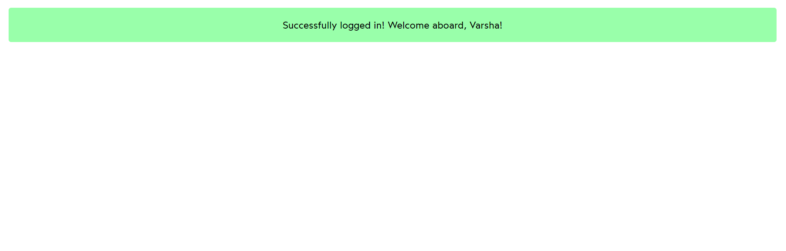

## Example : Product Component

<h3></h3>

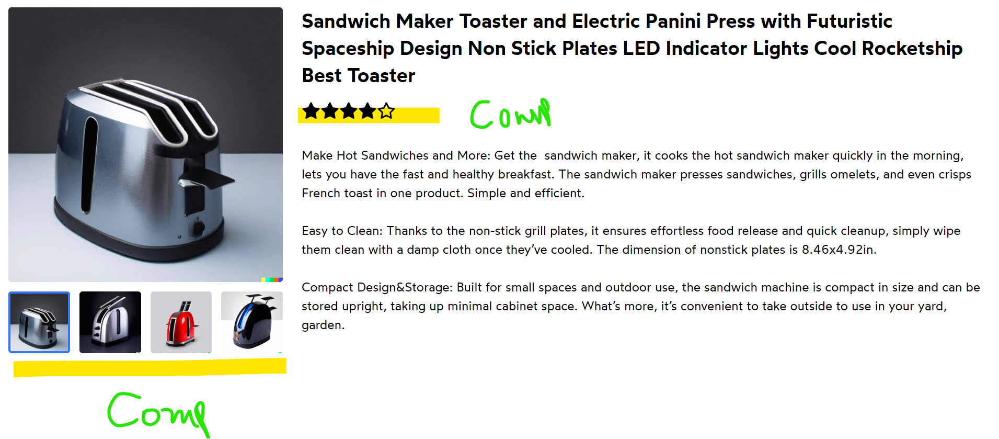

## Example : Product Cart Component

<h3> Use of CSS styles and applicable to the component dynamically </h3>

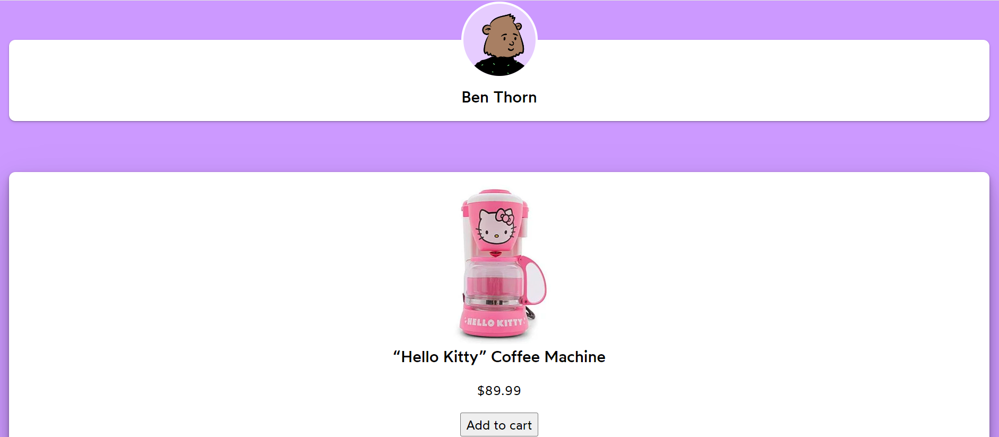

<h1> Props Delegation</h1>

## Example : Slider Component

<h3>Use of delegation as a property inside the Slider component</h3>

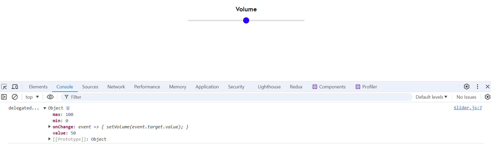

## Example : Toggle Component

<h3>Use of delegation as a property inside the Toggle component</h3>

<h1> ForwardRef </h1>

## Example : Slider Component

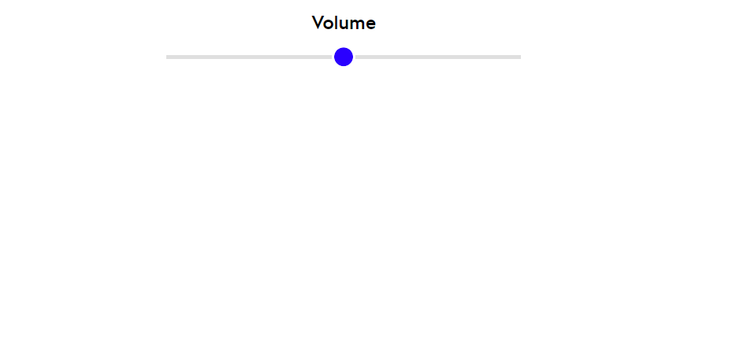

## Example : Hover Button

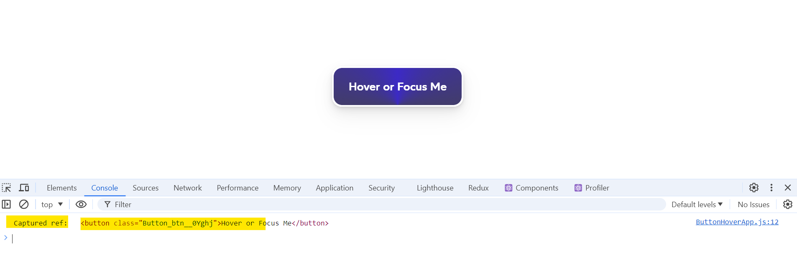

## Example : Slider Square

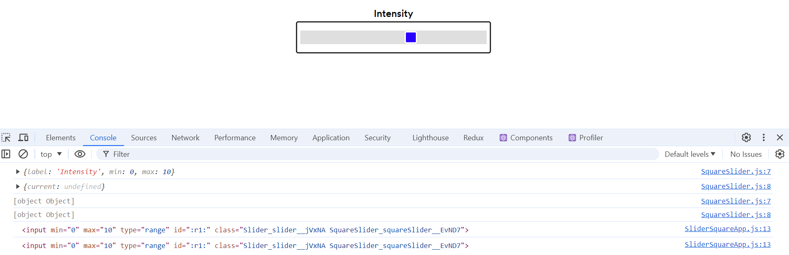

<h1> Polymorphism </h1>

## Example : Render anchor or Button tag

<h3>Dynamically render < a > tag or < button > tag based on href </h3>

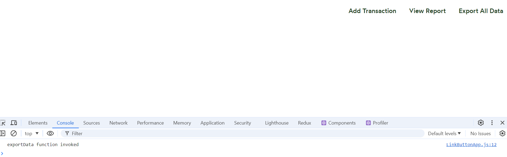

## Example : Passing ListItem as="ol" or "ul"

## Example : Dynamic header

<h3>Concept of Polymorphism : According to props passed, dynamica header will be applied</h3>

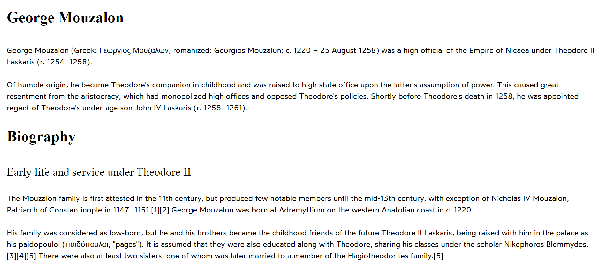

## Example : Different Source of Picture

<h3> Polymorphic way of passing image & caption tag. (Using multiple source of image - render based on user's device capability) </h3>

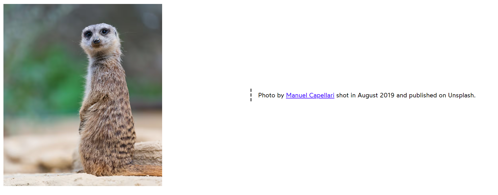

## Example : Icon Button

<h3> Concept Used : Passed component as prop & used in another component </h3>

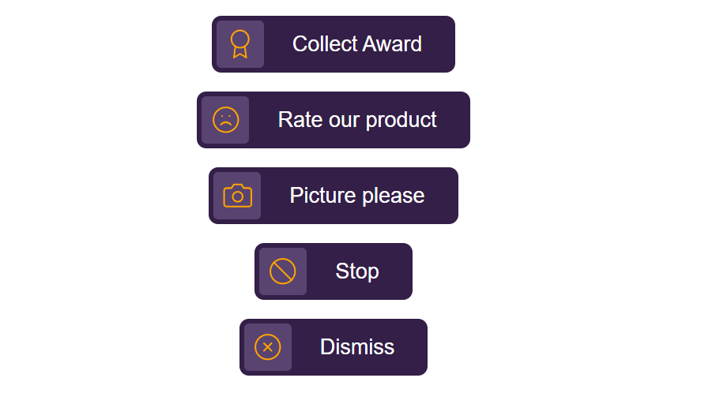

## Example : Props Drilling

<h3> Access user info from App component to ModuleLessons component.
At each level it needs to pass the infomation to get access user info in ModuleLessons component. 
</h3>

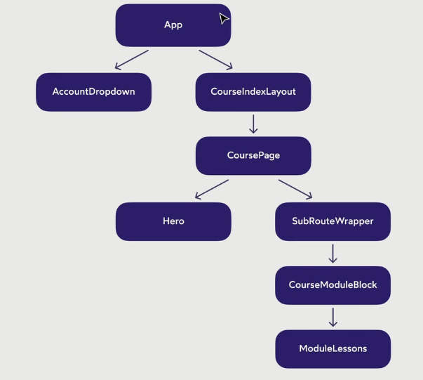

