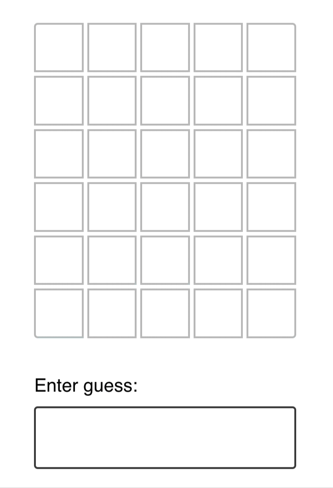
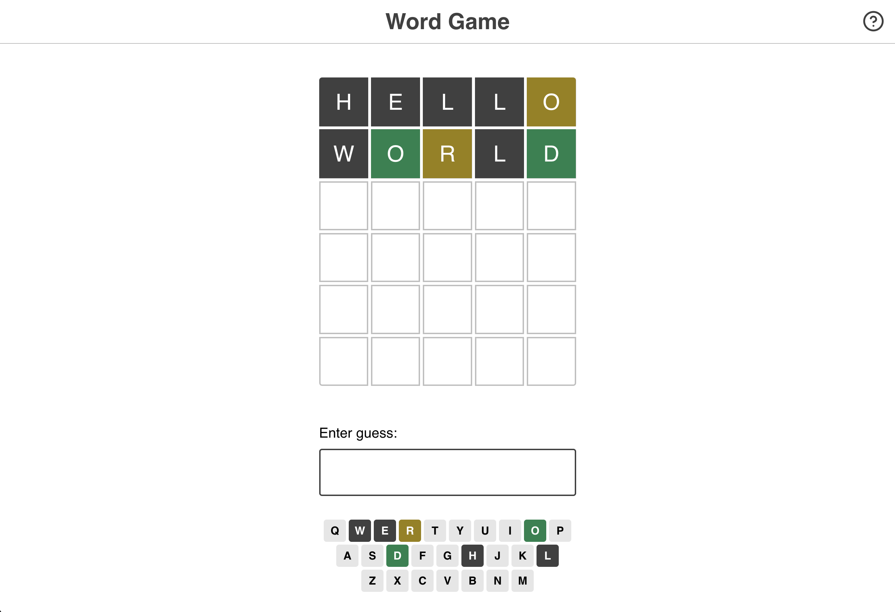

# Word Game

In Wordle, users have 6 attempts to guess a 5-letter word. You're helped along the way by ruling out letters that aren't in the word, and being told whether the correct letters are in the correct location or not.

## Getting Started

This project is created with [Parcel](https://parceljs.org/), a modern JS build tool. It's intended to be run locally, on your computer, using Node.js and NPM.

## Step 1: GuessInput

First thing’s first: Submit guesses!

In the standard Wordle game, a global event listener registers keypresses. This isn't very accessible, and so we're going to do things a little bit differently.

We'll render a little form that holds a text input:

Created a new component for this UI, and render it inside the `Game` component.

## Step 2: Keeping track of guesses

Render each guesses of a user.

## Step 3: Guess slots

**In the real Wordle game, the initial screen shows 6 rows of 5 squares :**
Display words in a grid. Show 6 rows of guesses, no matter how many guesses the user has submitted, and each row will consist of 5 cells.

As the user submits guesses, their guess will populate the cells:

# Used files and components to render grid :

There are two things that should help you tackle this exercise:

1. Used the `range` utility to create arrays of a specified length to map over. It's provided in `/src/utils.js`. Check out the “Range Utility” lesson in the course for more info on how to use it.
2. Inside `/src/constants.js`, created a constant, `NUM_OF_GUESSES_ALLOWED`. Used this constant when generating the set of guesses.

## Step 4: Game Logic

Added some CSS classes to color the background of each cell, based on the results and the correct answer:

Inside `/src/game-helpers.js`, created a helper function, `checkGuess`. As parameters, it takes a single guess, as well as the correct answer. It returns an array that contains the status for each letter.

There are 3 possible statuses:

- **correct** — this slot is perfect. It's the right letter in the right place.
- **misplaced** — this letter does exist in the word, but in a different slot.
- **incorrect** — this letter is not found in the word at all.

## Exercise 5: winning and losing

If the user wins the game, a happy banner should be shown:

If the user loses the game, by contrast, a sad banner should be shown:

## Visual Keyboard

In the real Wordle game, a keyboard is shown below the guesses:

This keyboard is an important game element, since it makes it easy to tell which letters have already been tested.

Here's what the keyboard looked like in my implementation:

## Restart button

One of Wordle's hooks is that you can only play 1 game per day: there's a new word for all users every day. As a result, there's no "restart button", you just have to wait until the next day.

In our clone, we aren't picking a new word every day, we're picking a new word when the app first loads.

Update the game so that it can be restarted. Add a "Restart game" button to the banner shown when the user wins or loses.

_HINT:_ This will require moving the `answer` into state. You'll want to do the random word selection inside a callback function, the secondary way to initialize state.
