# Started with React Deep Dive Concepts Practices

## Example : Price Slide Animation Not Working on Selection

> Solution 1: Use keys.
> Solution 2: Use state to show or hide the class.

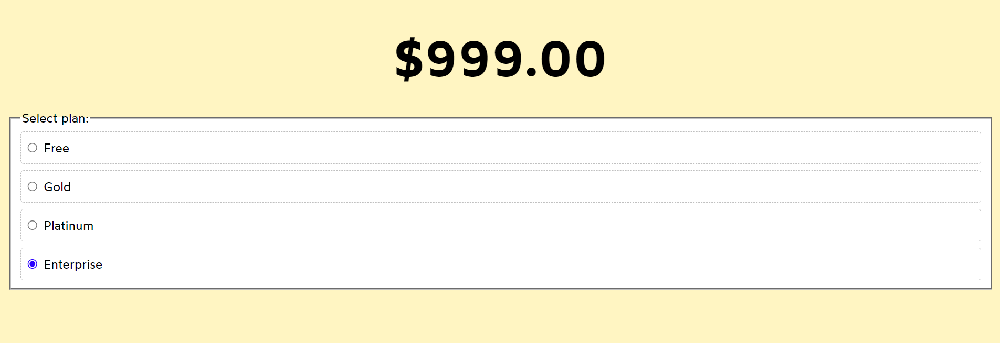

## Example : Animation Doesn't Work When Two Prices Are the Same

> Solution : Use a unique key instead of the price.

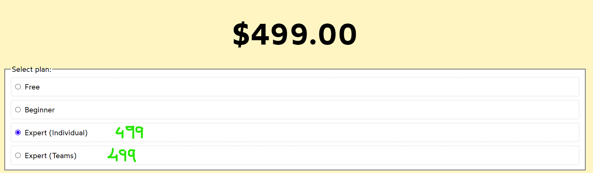

## Example : Display Floating Text on Coin Click

> Solution : Add the coin value as the key to the floating text component.

`Note : this time we are creting & destroying the component instance each time`

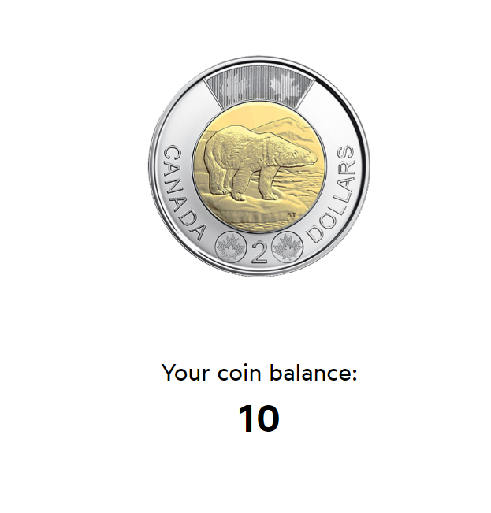

## Example : FloatingText Should Not Display When the PiggyBank Button is Clicked

> Solution : Create separate states for the coinUpdate button and the buyPiggyBank button.

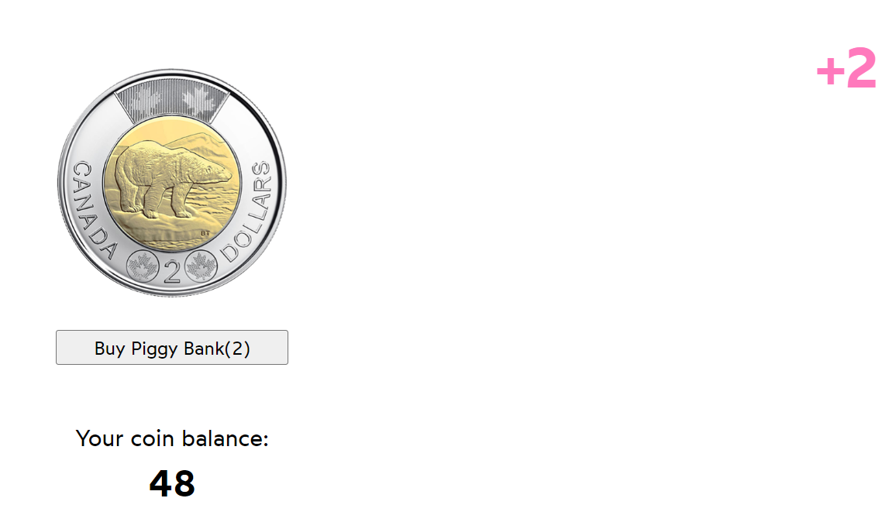

## Example : Resetting State

Each instance of the Counter component maintains its own state.
When you click the button in one Counter instance,
it only updates the state of that specific instance.

## Example : Preserve State

In the CounterPreserveApp example, the Counter component is rendered conditionally, but it does not change the key or cause the component to unmount and remount. Therefore, the state of the Counter component is preserved across re-renders.

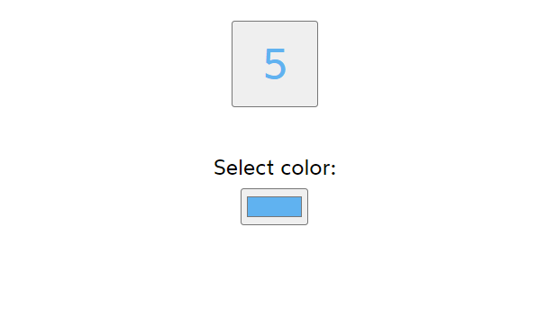

## Example : Compose Tweet

> Solution : Optimized the application by eliminating the useEffect hook and updating the character counter using simple JavaScript variables.

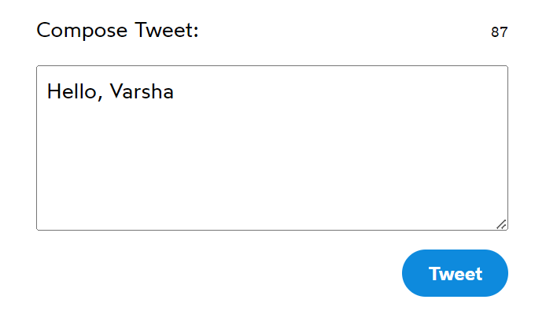

## Example : Shopping Cart

> Issue: Cart total not updating when removing items

> Solution : Added useEffect hooks for total and subtotal updates, and formatted the total using the Intl library.

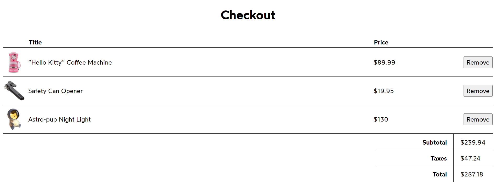

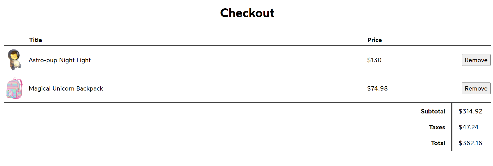

## Example : Temperature

> Issue : With the current code, we're storing two state variables, one for the celsius value, and one for the fahrenheit value. Task is to simplify this code by having a single state variable that holds information about the temperature

> Solution : Optimized by reducing the use of hooks and state variables

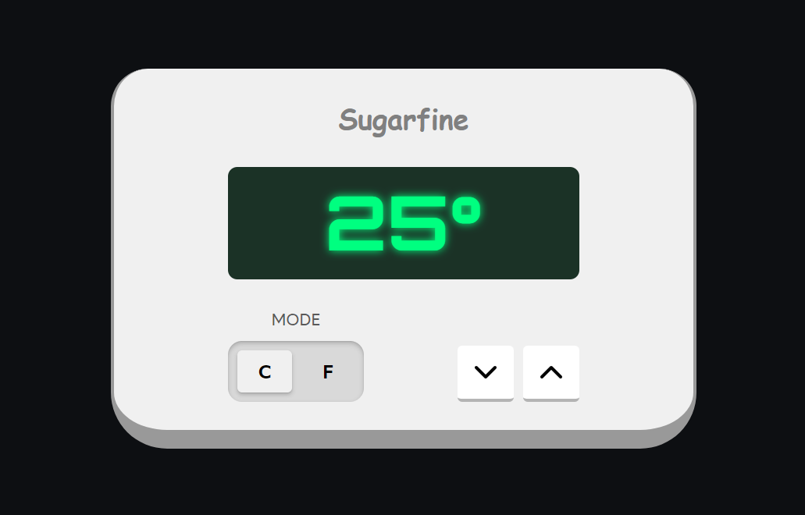

## Example : The News Article

> Task : Refactor the code so that Article receives the articleSlug prop directly: without using context, and without funnelling the prop through an intermediary component.The DOM structure shouldn't change at all.

> Solution : Implemented the strategy of lifting content up to eliminate props drilling.

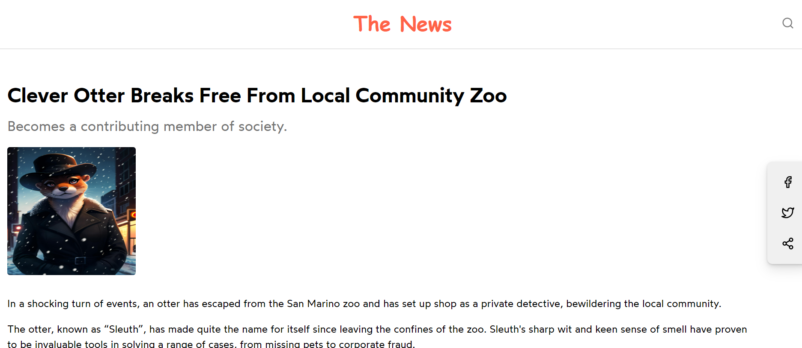

## Example : Cart Counter

> Task : The header has a cute shopping cart button, and the button has a badge that increments as the user starts adding items to their cart. restructure things so that App owns the CartButton component, without changing the DOM structure at all.

> Solution : demonstrates the technique of passing a component `<CartButton />` as a prop (actions) to another component `<Header />`

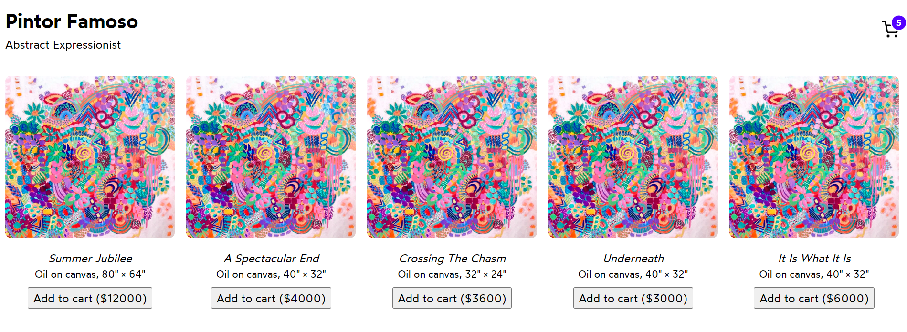
