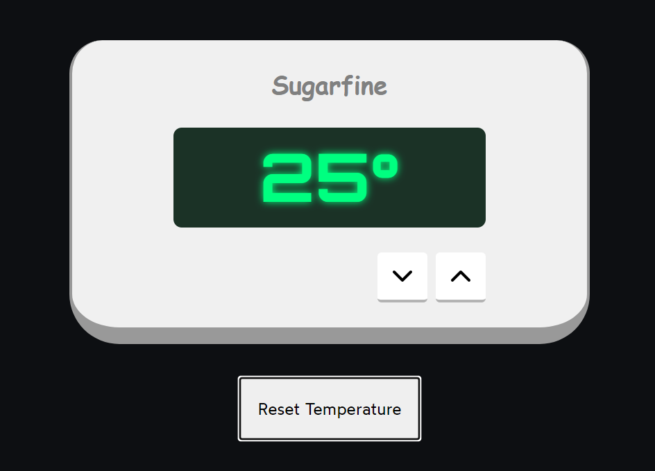
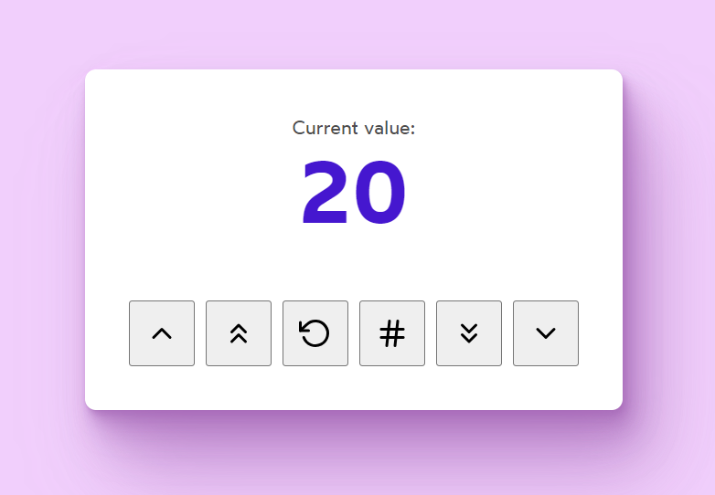
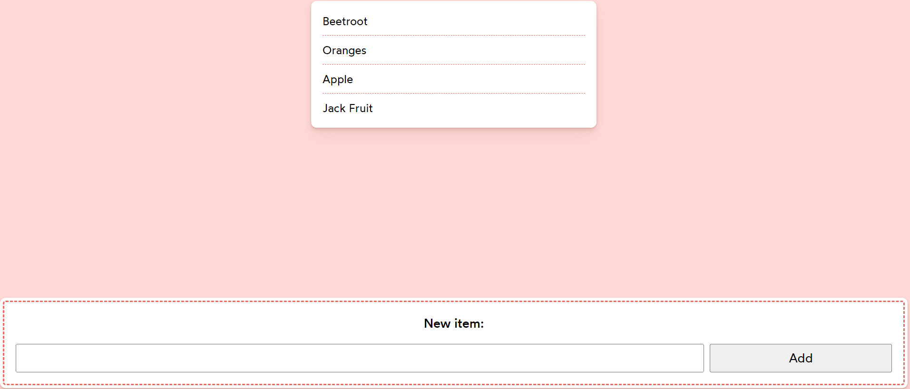
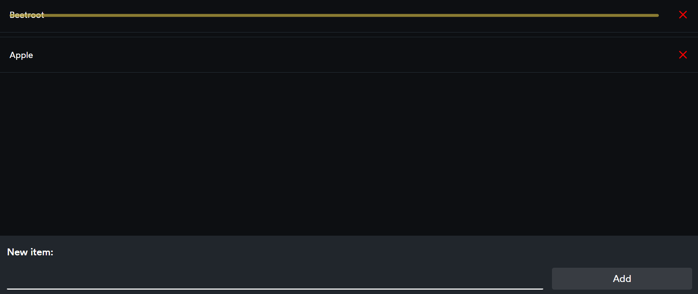
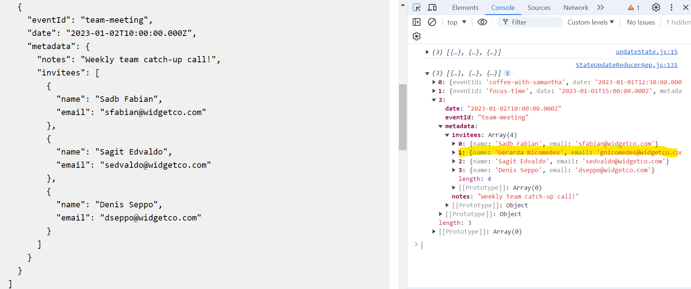
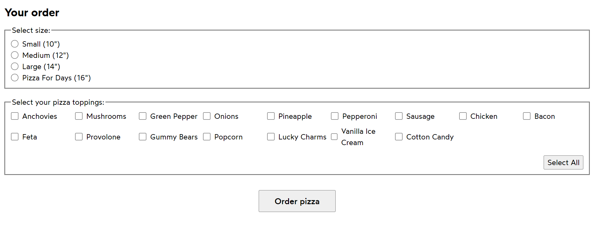
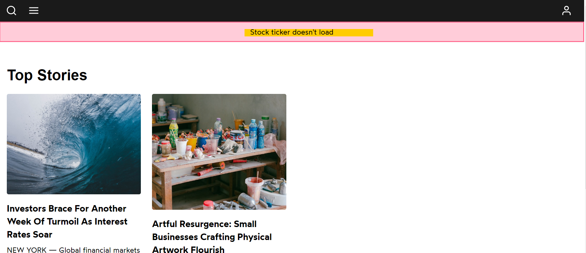

# Started with React Deep Dive Concepts Practices

## Example : Price Slide Animation Not Working on Selection

> Solution 1: Use keys.
> Solution 2: Use state to show or hide the class.


## Example : Animation Doesn't Work When Two Prices Are the Same

> Solution : Use a unique key instead of the price.


## Example : Display Floating Text on Coin Click

> Solution : Add the coin value as the key to the floating text component.

`Note : this time we are creting & destroying the component instance each time`


## Example : FloatingText Should Not Display When the PiggyBank Button is Clicked

> Solution : Create separate states for the coinUpdate button and the buyPiggyBank button.


## Example : Resetting State

Each instance of the Counter component maintains its own state.
When you click the button in one Counter instance,
it only updates the state of that specific instance.


## Example : Preserve State

In the CounterPreserveApp example, the Counter component is rendered conditionally, but it does not change the key or cause the component to unmount and remount. Therefore, the state of the Counter component is preserved across re-renders.


## Example : Compose Tweet

> Solution : Optimized the application by eliminating the useEffect hook and updating the character counter using simple JavaScript variables.


## Example : Shopping Cart

> Issue: Cart total not updating when removing items

> Solution : Added useEffect hooks for total and subtotal updates, and formatted the total using the Intl library.


## Example : Temperature

> Issue : With the current code, we're storing two state variables, one for the celsius value, and one for the fahrenheit value. Task is to simplify this code by having a single state variable that holds information about the temperature

> Solution : Optimized by reducing the use of hooks and state variables


## Example : The News Article

> Task : Refactor the code so that Article receives the articleSlug prop directly: without using context, and without funnelling the prop through an intermediary component.The DOM structure shouldn't change at all.

> Solution : Implemented the strategy of lifting content up to eliminate props drilling.


## Example : Cart Counter

> Task : The header has a cute shopping cart button, and the button has a badge that increments as the user starts adding items to their cart. restructure things so that App owns the CartButton component, without changing the DOM structure at all.

> Solution : demonstrates the technique of passing a component `<CartButton />` as a prop (actions) to another component `<Header />`


## Example : Temprature (Single Source of Truth)

> Issue : Optimized the code by limiting use of hooks and made it in sync.

> Solution : Using Single Source of Truth



## Example : Counter App

> Note : By giving the prop a name like initialVal, we're making clear that this prop is only used for the initialized value of the count state variable and and that changes to that prop won't affect the state.

```
 function CounterApp() {
    return (
        <>
            <Counter initialVal={10} />
        </>
    );
}
```



## Example : Shopping List

> Note : The AddNewItemForm component is controlled because the input's value is supplied and managed via state.



## Example : Todo App (Centralized Logic in App)

> Enhanced the application logic to achieve greater modularity and maintainability.



# useReducer Hook

## Example : Todo App (Updated code using useReducer)

## Example : Cart Counter App (Updated code using useReducer)

## Example : Counter App (Updated code using useReducer)

## Example : Gradient Generator (Utilized two state variables and updated logic using useReducer)

> Overview

1. State Management: The component uses a reducer function to handle the state changes.
2. State: It includes a list of colors and the number of visible colors.
3. Actions: Users can add or remove colors from the gradient and change the colors.

## Example : Update State without mutate any array or objects



# Immer

The produce function we get from Immer takes two arguments:

The state we'd like to edit (currentState)
A callback function ((draftState) => {})

draftState is a special “wrapped” version of currentState.
I like to think of it as a shielded version: Immer is its guardian, and will make sure that the original object is never mutated,
no matter what we try to do to this wrapped version.

After running the code in our callback function, produce will resolve to a brand-new object, with all of the modifications applied.

It allows us to write code that looks like it mutates the data. Using some modern JS trickery, however, the data is never actually mutated.

Performance :

Fortunately, Immer doesn't do anything as mundane as a deep copy. It does something much more impressive.
Immer uses a technique known as structural sharing,
and it's made possible using Proxies.

Specifically, proxies are special object wrappers that allow us to "intercept" mutations. We wrap the React state in a Proxy, and then when we try to mutate that object, the Proxy swoops in and converts our mutation into an immutable operation.

Note : If Immer was doing a typical “deep copy” operation, everything would be reconstructed from scratch. But thanks to this “structural sharing” magic with Proxies, we only reconstruct the parts of the state that change.

## Example : UpdateState using Immer(produce)

## Example : AddNumbers In Array

## Example : Gradient Generator

## Example : Todo App

## Example : Order Pizza

> Task : Manage the state using useReducer and Immer.

**Acceptance Criteria:**

<li>When the user submits the form, a window.alert should show us what size and toppings they've selected.</li>
<li>The radio buttons and checkboxes should be controlled by the reducer's state.</li>
<li>The “Select All” button should add all of the toppings.</li>
<li>If all of the toppings are selected, however, the button label should flip to "Remove All", and it should toggle all of the toppings off.
</li>



## Example - Use of Error Boundry

If application throws an error during rendering, React will remove its UI from the screen. To prevent this, you can wrap a part of your UI into an error boundary. An error boundary is a special component that lets you display some fallback UI instead of the part that crashed—for example, an error message.


