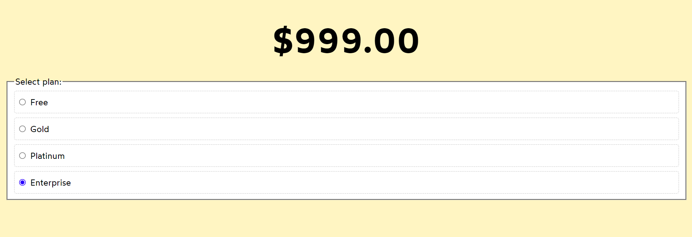

# Started with React Deep Dive Concepts Practices

## Example : Price Slide Animation Not Working on Selection

> Solution 1: Use keys.
> Solution 2: Use state to show or hide the class.

## Example : Animation Doesn't Work When Two Prices Are the Same

> Solution : Use a unique key instead of the price.

## Example : Display Floating Text on Coin Click

> Solution : Add the coin value as the key to the floating text component.

`Note : this time we are creting & destroying the component instance each time`

## Example : FloatingText Should Not Display When the PiggyBank Button is Clicked

> Solution : Create separate states for the coinUpdate button and the buyPiggyBank button.

## Example : Resetting State

Each instance of the Counter component maintains its own state.
When you click the button in one Counter instance,
it only updates the state of that specific instance.

## Example : Preserve State

In the CounterPreserveApp example, the Counter component is rendered conditionally, but it does not change the key or cause the component to unmount and remount. Therefore, the state of the Counter component is preserved across re-renders.

