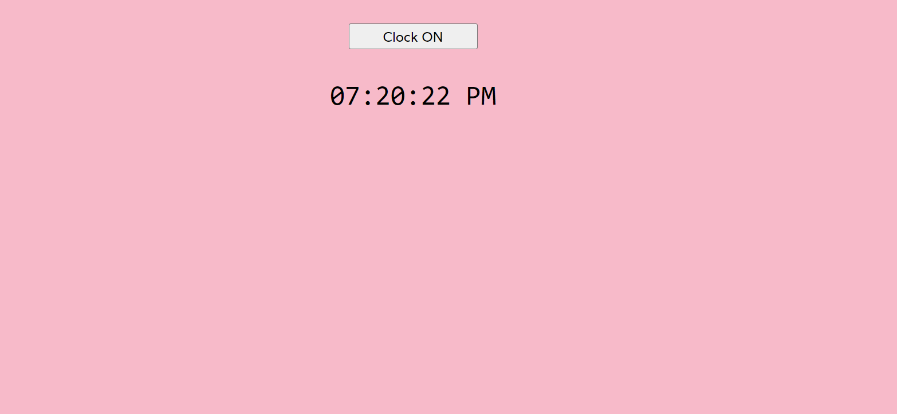
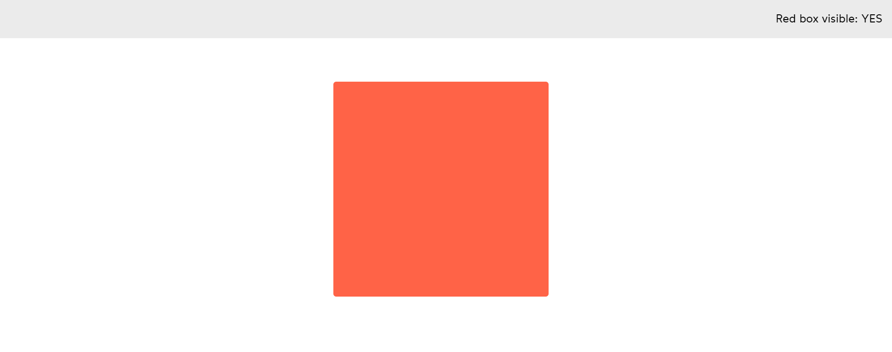
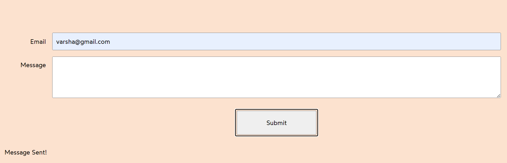
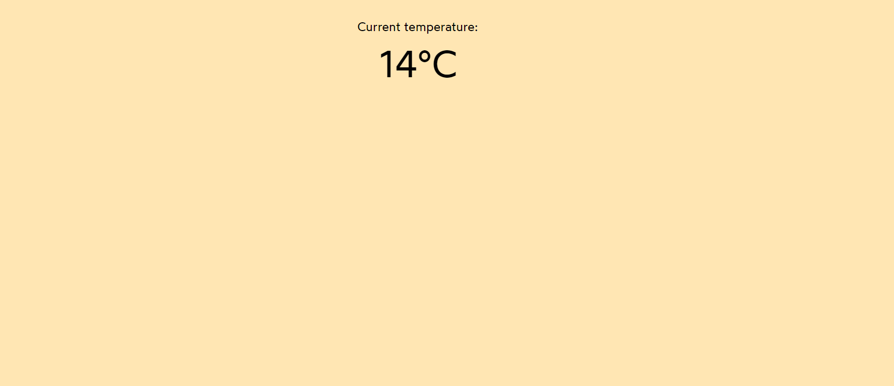
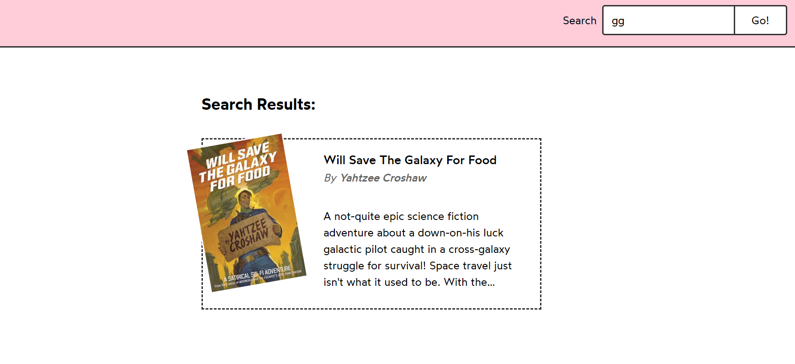
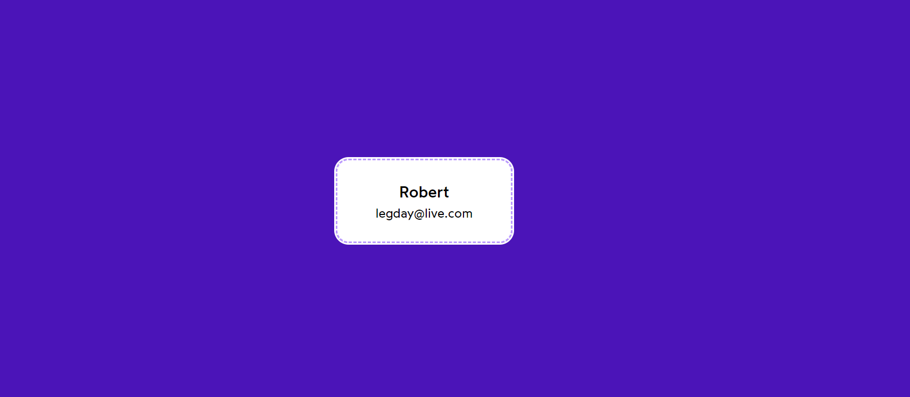
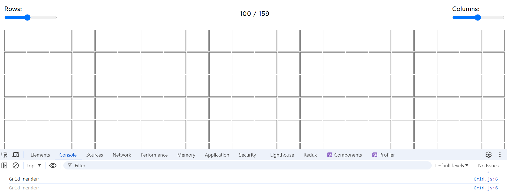
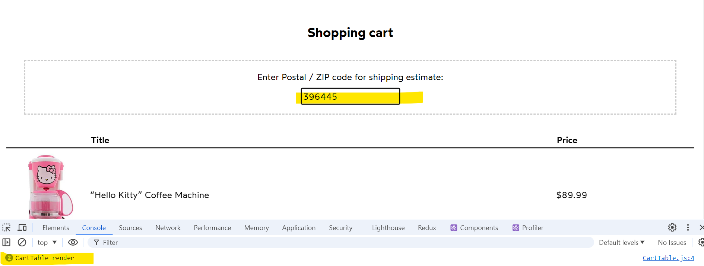
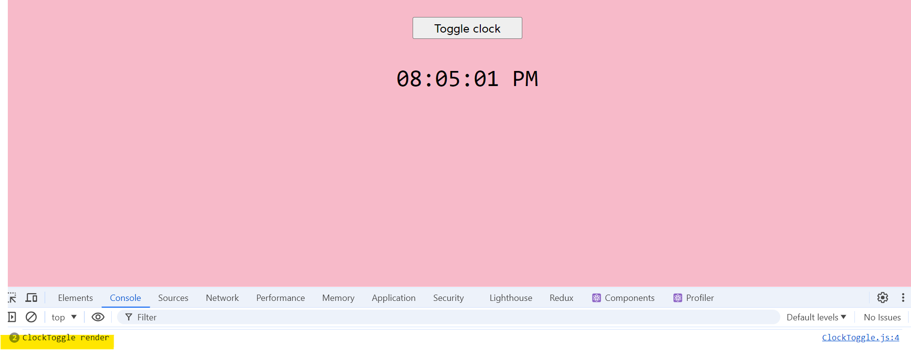
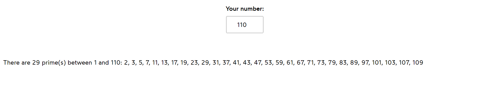

# React.useId() Hook

## Example : Login Form

<h3>This hook is utilized in both the header and footer components to dynamically assign unique IDs using React.useId().</h3>

## Example : Using React.useId()

## Example : SearchApp

#### Package Install : npm i react-feather

#### Icons : https://feathericons.com/

## Example : LoginForm

`Usage Tip:` Place hooks at the top of the component declaration, not within conditional statements.

# React.useRef() Hook

The React.useRef() hook stores the current properties of the selected element.

## use of window.stateValues

`window.stateValues` refers to a global variable in JavaScript that can store and access state-related data across different parts of an application. It allows for centralized state management and can be particularly useful in applications where state needs to be shared and accessed globally.

## Example : Canvas App

## Example : Video Player

<video controls src="src/02_useRef-hook/03_videoplayer/VideoPlayer_Initial.mp4"></video>

<video controls src="src/02_useRef-hook/03_videoplayer/VideoPlayer_After_Speed.mp4"></video>

## Example : Media Player

# React.useEffect() Hook

`React.useEffect()` is a hook in React that allows you to perform side effects in function components. It is used to manage effects like data fetching, subscriptions, or manually changing the DOM from within React components. This hook runs after every render of the component by default, and you can optionally specify cleanup for effects returned by the hook.

It replaces lifecycle methods like componentDidMount, componentDidUpdate, and componentWillUnmount in function components.

## Example : Counter App

This example demonstrates how to use the useEffect hook in React to update the document title dynamically based on the current count value.

## Example : Sign Up Form

Use of useEffect in Form Handling

## Example : Toggle Dark Mode / Store Value to Local Storage

This example demonstrates using a callback function inside the useState hook to toggle dark mode and store the mode value in local storage.

## Example : Input Focus on mount

Set focus on an input element when the page loads.

## Example : Track the Mouse Pointer on Mouse Move

Demonstrates using the `useState` hook with an object `{ x, y }` to track the position of the mouse pointer as it moves.

## Example : Window Resize

### Set Window Dimensions According to Window Size

Utilizes the `useState` hook with an object `{ width, height }` to dynamically update and track the dimensions of the window as it is resized.

## Example : Intersection Observer

### Slide Left Animation on Intersection

Demonstrates sliding a character left when a specified division intersects using the `Intersection Observer API`.

<video controls src="src/03_useEffect-cleanup-hook/SlideCharacter_InterSectionObserver.mp4"></video>

# Use of return in useEffect: Clean Up Activity

## Example : Enable/Disable Mouse Tracking based on button click

This example illustrates how to use the clean-up function in `useEffect` to enable or disable mouse tracking based on a button click event.

## Example : Clock Interval - Removing Interval with useEffect's return

This example demonstrates how to manage a clock interval and properly clean it up using the `return` function in `useEffect`.

## Example : Automatically Turn On Checkbox if Unchecked

Automatically checks the checkbox after a timeout of 500 ms if it's currently unchecked.

## Example : Media Player (Spacebar)

### Enhanced Functionality: Space Bar and Button Click Interaction

Implements a callback function within a state variable to enhance functionality, allowing interaction through both space bar presses and button clicks.

## Example : Timer (setInterval / setTimeout)

Update the counter value

# Custom Hooks

## Example : Toggle Clock

## Example : Mouse Position

Handling Mouse Pointer Movements with Custom Hooks

## Example: Observing Box Division Availability

Using Intersection Observer and Custom Hooks </h3>

# Stale While Revalidate (SWR) Library and Async Await

## Example : Use of Async Await and Display Message Based on Status

Demonstrates the usage of async await with the SWR library to fetch data and display messages based on the fetch status.

#### installed package : `npm i swr`

## Example : Fetch Temprature using SWR Library

Demonstrates fetching temperature data using the SWR library.

## Example : Search Book

## Example : Display Spinner while Loading Usernames

Illustrates how to use the SWR library to fetch user details and display a spinner while the data is loading.

# Memoization Using useMemo() Hook

## Example : Rows & Columns

Demonstrates how to improve performance by memoizing the computation of rows and columns based on mouse pointer movements using the useMemo() hook.

## Example : Shopping Cart

Addresses and optimizes re-rendering issues of components when updating the ZIP code in a shopping cart application.

## Example : ToggleClock

Optimizing the Toggle Clock function with React Function Reference

**Files Involved:**

_React concept :_ Reference a function in another component
_ClockToggle.js :_ Calls the Function
_ClockApp.js :_ References a function from use-toggle.js
_use-toggle.js :_ Defines a function

## Example : Prime Numbers

Demonstrates how to calculate and display prime numbers from a list of inputed numbers.

