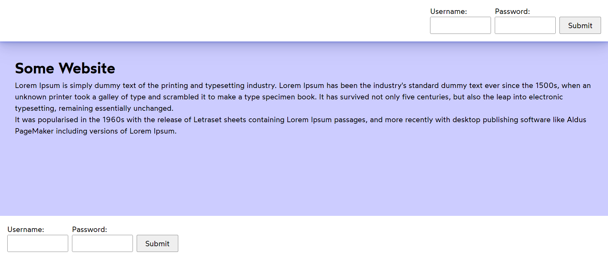
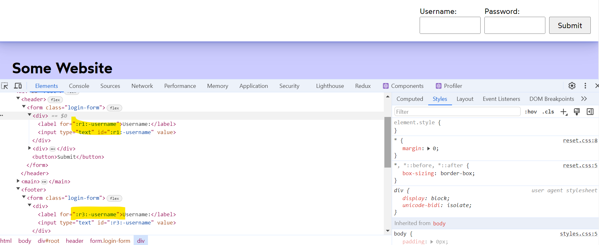
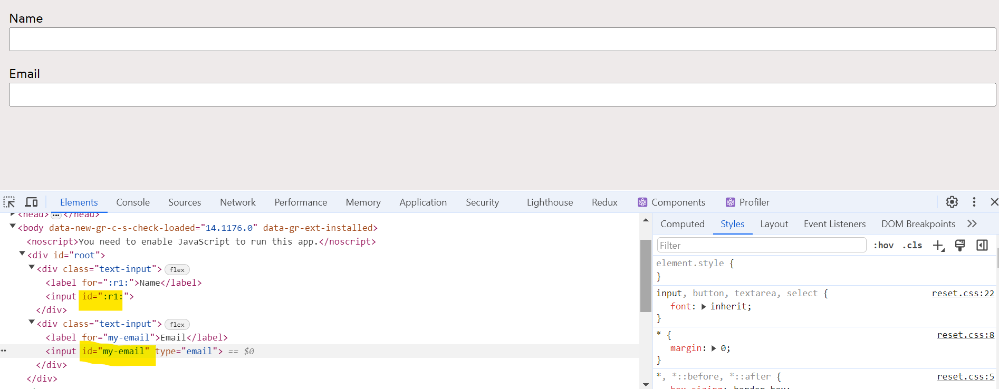
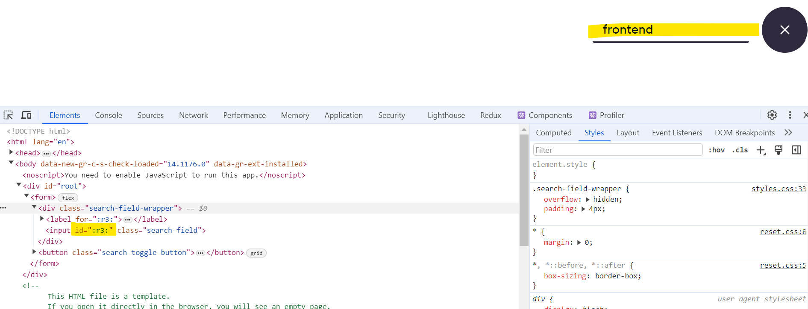
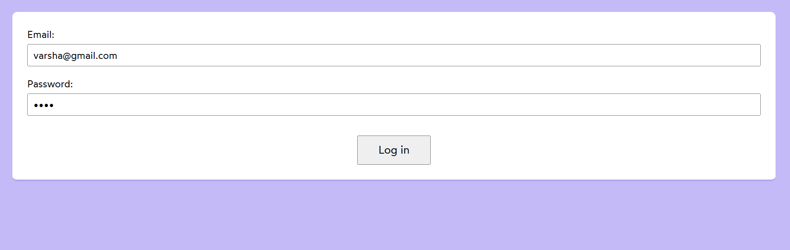
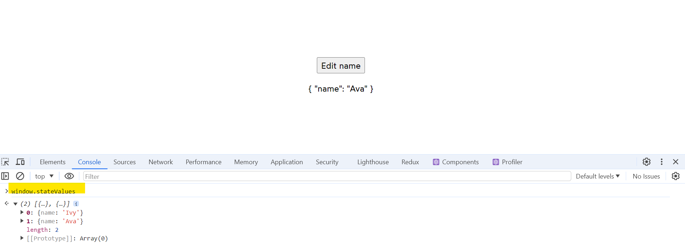
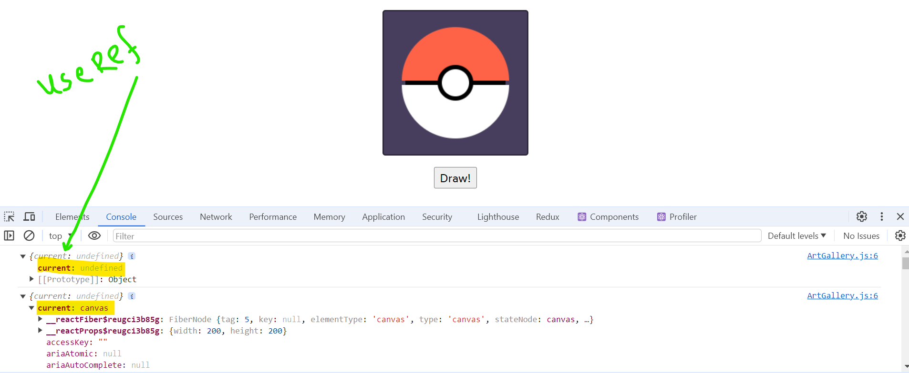
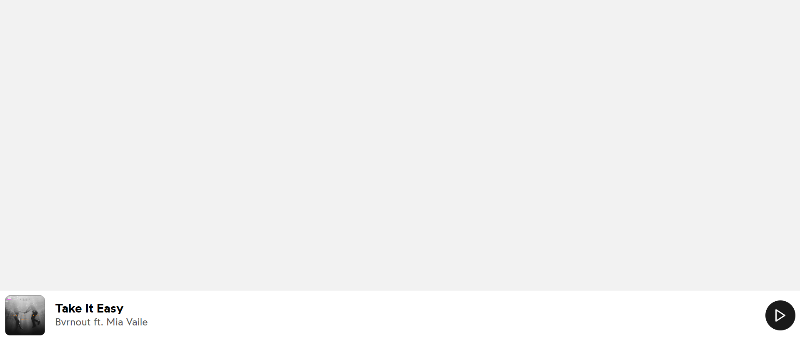

<h1> React.useId() hook </h1>

## Login Form - Used in header and footer but react adds unique id using React.useId()

## use of React.useId()

## SearchApp

#Package Install : npm i react-feather

Icons : https://feathericons.com/

## LoginForm

 Use hooks at top of the declaration of component not after condition. 

<h1> React.useRef() hook </h1>

React.useRef() hook will contain the current properties of selected element. 

## use of window.stateValues

## Canvas App

## Video Player

<video controls src="src/02_useRef-hook/03_videoplayer/VideoPlayer_Initial.mp4"></video>

<video controls src="src/02_useRef-hook/03_videoplayer/VideoPlayer_After_Speed.mp4"></video>

## Media Player

