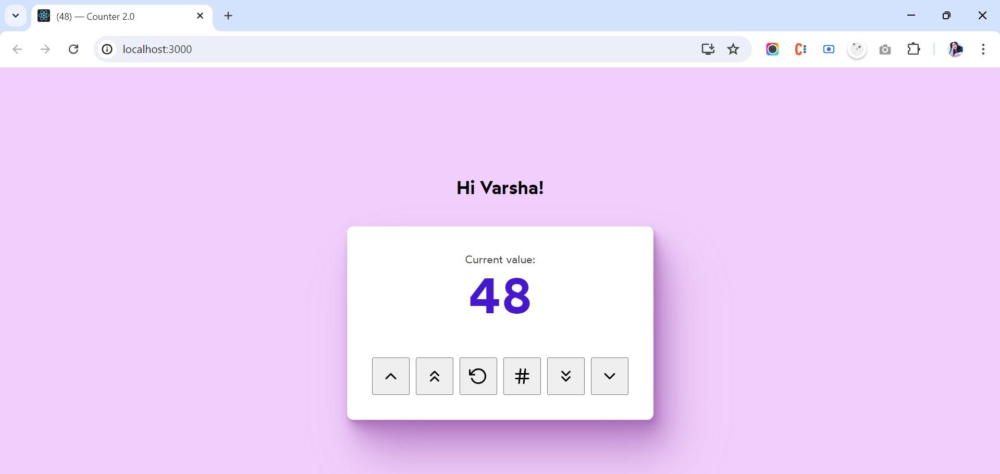
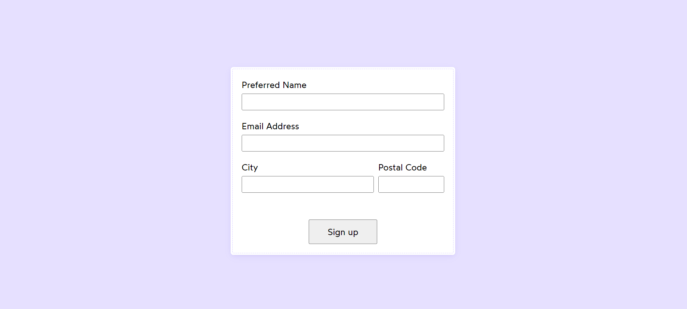
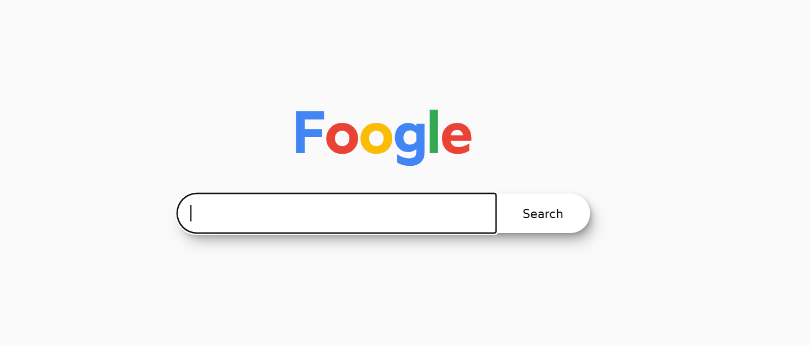
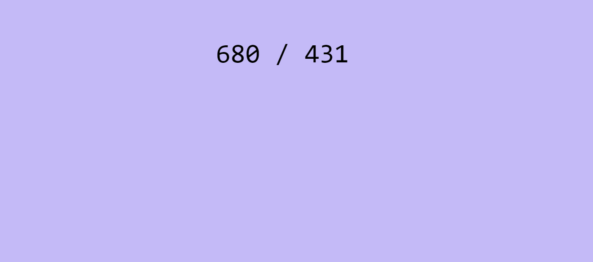
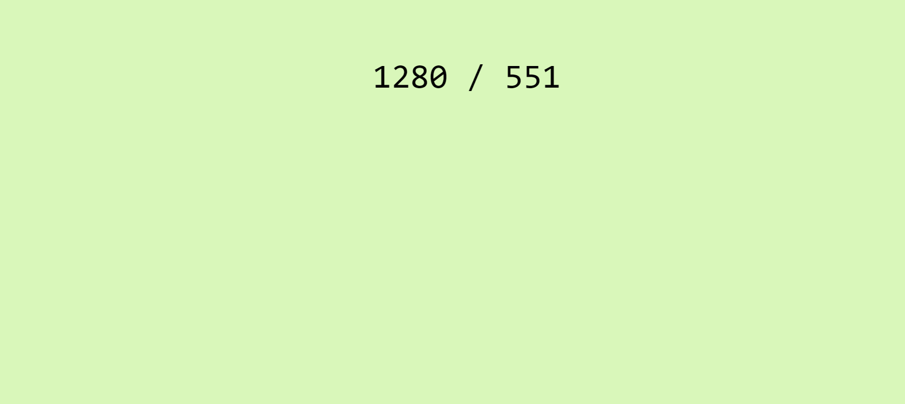

<h1> React.useId() hook </h1>

## Login Form - Used in header and footer but react adds unique id using React.useId()

## use of React.useId()

## SearchApp

#Package Install : npm i react-feather

Icons : https://feathericons.com/

## LoginForm

 Use hooks at top of the declaration of component not after condition. 

<h1> React.useRef() hook </h1>

React.useRef() hook will contain the current properties of selected element. 

## use of window.stateValues

## Canvas App

## Video Player

<video controls src="src/02_useRef-hook/03_videoplayer/VideoPlayer_Initial.mp4"></video>

<video controls src="src/02_useRef-hook/03_videoplayer/VideoPlayer_After_Speed.mp4"></video>

## Media Player

<h1> React.useEffect() hook </h1>

## Counter App

<h3>Update the document title using useEffect</h3>

## Sign Up Form

<h3>Use of useEffect form</h3>

## Toggle Darkmode

<h3>Toggle darkmode / Store value to the local storage</h3>
<h4>Used callback funcion inside the useState state variable</h4>

## Input Focus on mount

<h3>On page load set input focus</h3>

## Mouse Pointer

<h3>Track the mouse pointer on mouse move</h3>
<h4>Used useState having object { x, y }</h4>

## Window Resize

<h3>Set Window Dimensions according to Window Size</h3>
<h4>Used useState having object { width, height }</h4>

## Intersection Observer

<h3>Slide left the character when division intersect</h3>

<video controls src="src/03_useEffect-cleanup-hook/SlideCharacter_InterSectionObserver.mp4"></video>
