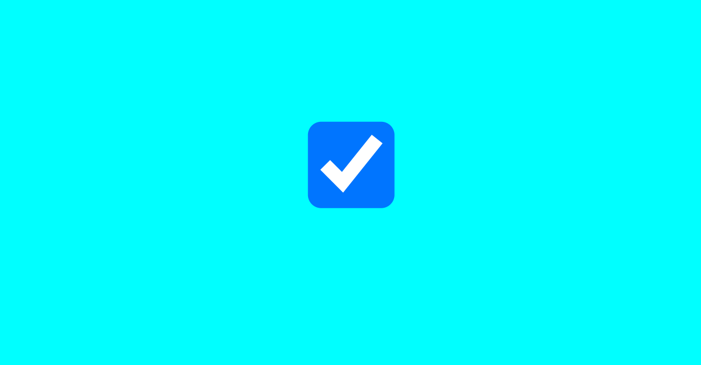
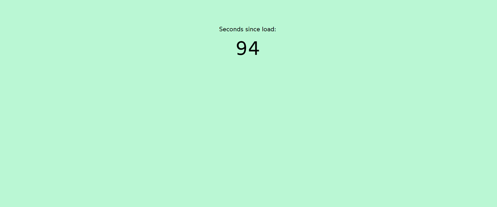

<h1> React.useId() hook </h1>

## Example : Login Form

<h3>Used in header and footer but react adds unique id using React.useId()</h3>

## Example : use of React.useId()

## Example : SearchApp

#Package Install : npm i react-feather

Icons : https://feathericons.com/

## Example : LoginForm

 Use hooks at top of the declaration of component not after condition. 

<h1> React.useRef() hook </h1>

React.useRef() hook will contain the current properties of selected element. 

## use of window.stateValues

## Example : Canvas App

## Example : Video Player

<video controls src="src/02_useRef-hook/03_videoplayer/VideoPlayer_Initial.mp4"></video>

<video controls src="src/02_useRef-hook/03_videoplayer/VideoPlayer_After_Speed.mp4"></video>

## Example : Media Player

<h1> React.useEffect() hook </h1>

## Example : Counter App

<h3>Update the document title using useEffect</h3>

## Example : Sign Up Form

<h3>Use of useEffect form</h3>

## Example : Toggle Darkmode

<h3>Toggle darkmode / Store value to the local storage</h3>
<h4>Used callback funcion inside the useState state variable</h4>

## Example : Input Focus on mount

<h3>On page load set input focus</h3>

## Example : Mouse Pointer

<h3>Track the mouse pointer on mouse move</h3>
<h4>Used useState having object { x, y }</h4>

## Example : Window Resize

<h3>Set Window Dimensions according to Window Size</h3>
<h4>Used useState having object { width, height }</h4>

## Example : Intersection Observer

<h3>Slide left the character when division intersect</h3>

<video controls src="src/03_useEffect-cleanup-hook/SlideCharacter_InterSectionObserver.mp4"></video>

<h1> Use of return in useEffect : Clean Up Activity </h1>

<h3>Enable/Disable Mouse Tracking based on button click</h3>

<h3> Clock Interval - Remove Interval using useEffect return </h3>

<h3> Automatically turn on the checkbox if it's unchecked </h3>
<h4> based on the timeout of 500 ms it will work</h4>

## Example : Media Player (Spacebar)

<h3>Added functionality of space bar & button click</h3>
<h2> callback function in state variable </h2>

## Example : Timer (setInterval / setTimeout)

<h3> Update the counter value</h3>

<h1> Custom Hooks </h1>

## Example : Toggle Clock

## Example : Mouse Position

<h3>with use of custom hooks handle the mouse pointer movements  </h3>

## Example : Observe the box division avaialblility

<h3> Used Intersection Observer & custom hooks </h3>

<h1> Stale While Revalidate(SWR) Library && Async Await</h1>

## installed package : npm i swr

<h3> Use of async await & according to status display message </h3>

## Example : Fetch Temprature using SWR Library

<h3> Fetch Temprature using SWR Library</h3>

## Example : Search Book

<h3> Search Book </h3>

## Example : Display Spinner while loading Usernames

<h3>Load user details using SWR library & show spinner before data load.</h3>

<h1> Memoization using useMemo() hook </h1>

## Example : Rows & Columns

<h3> Optimized the re-rendering on mouse pointer move using useMemo() hook </h3>

## Example : Shopping Cart

<h3> Optimzed the Re-rendering issue of component on ZIP code updation </h3>

## Example : ToggleClock

<h3> Optimized the Toggle Clock function which updates </h3>
<h4> React concept : Reference a function in another component </h4>

 ClockToggle.js : Call the Function 

 ClockApp.js    : Reference a function from use-toggle.js

 use-toggle.js  : where function is actually defined

## Example : Prime Numbers

<h3>Display prime numbers of inputed numbers</h3>

