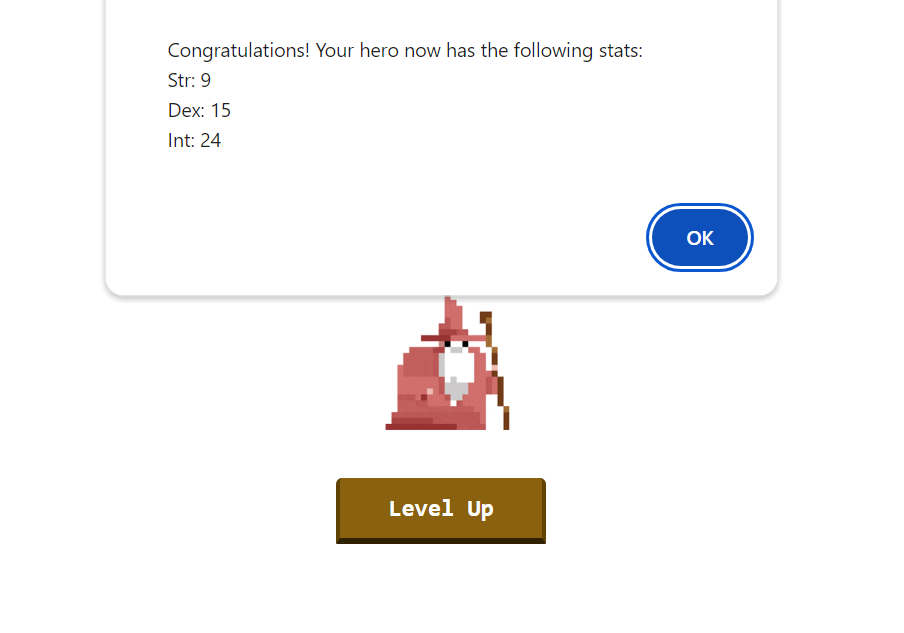
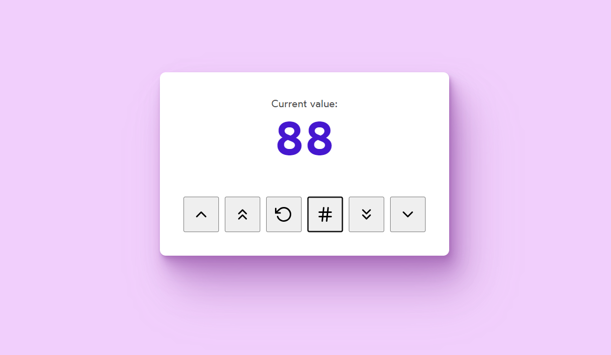

# Understanding Hooks

## Example : Asynchronous State Updates

 Introduction to state variables. React manages state updates asynchronously rather than synchronously.

## Example : Counter Application

Develop a counter application that allows adding, subtracting, and generating random numbers.

