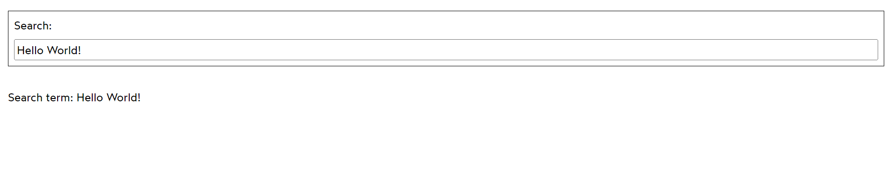
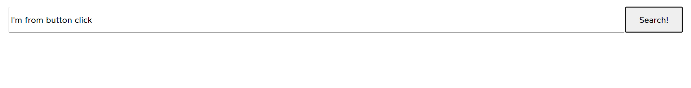
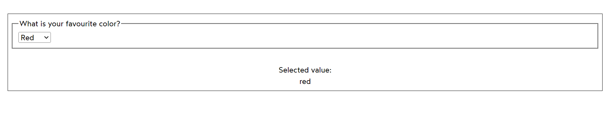
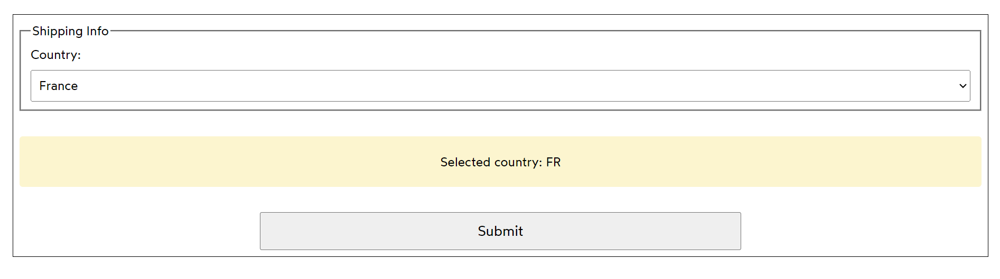
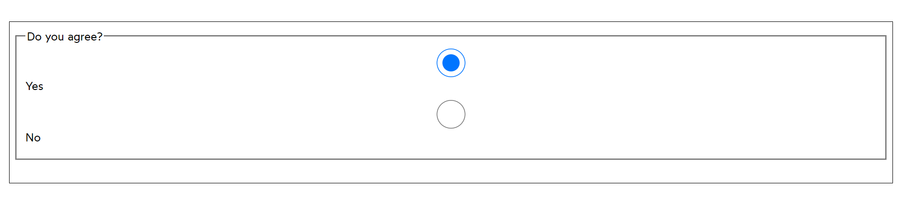
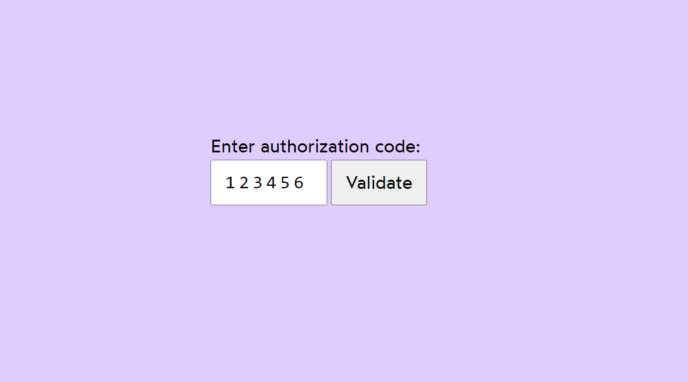
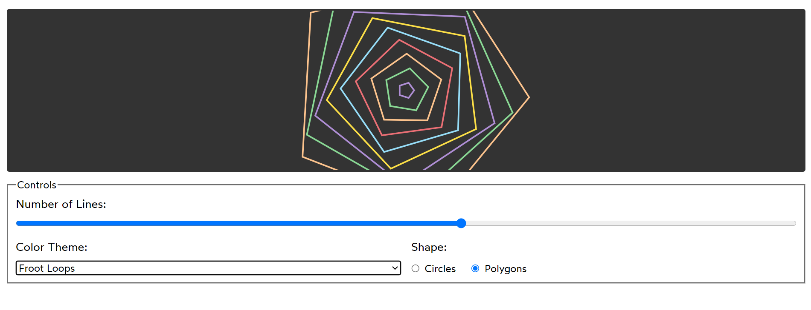

# Form Elements

## Example : Input Field (One-way Binding)

Utilize an input field to accept data from the user.

## Example : Input Field (Two-way Binding)

 Utilize an input field to accept data from the user and update the input box upon clicking a button. 

## Example : Dropdown Usage

## Example : Rendering Dropdown Values from an Object

## Example : Checkbox Usage

## Example : Authentication Form with Form Submission

Create an authentication form that utilizes form submission in React.

## Example : Generative Art with Form Inputs

Explore generative art using form inputs, dropdowns, and radio buttons.

