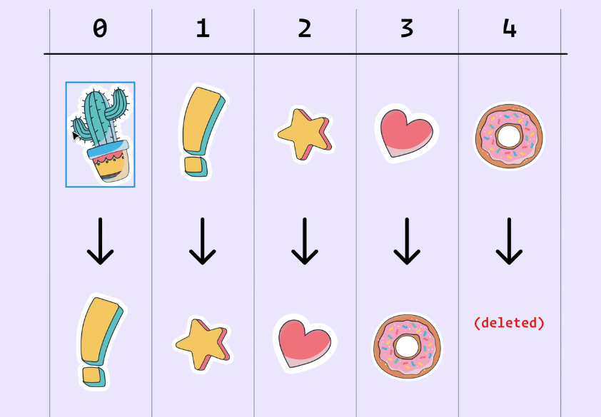
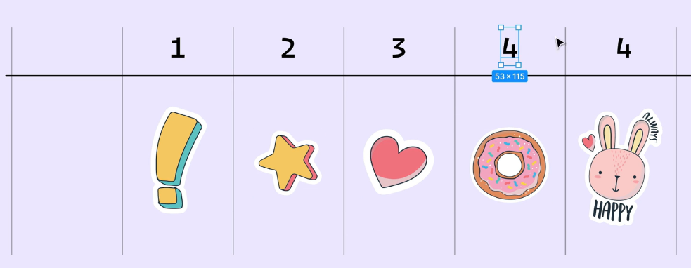

# Key Considerations for Array Rendering in React Components

## Keys Utilized: `index`, `random value (e.g., crypto.randomUUID())`, `Date.now()`, `array length`

`Index as a Key`

When choosing keys for elements in React components, consider that using `index` may lead to issues when elements are added or removed from an array. This is because the `index` changes with array modifications.

It's recommended to use `index` keys only when you're certain the array's content will remain stable without deletions or modifications.

## Key Considerations for Key Usage in React Components

`Using Array Index as Key:`

When using an array index as a key, sibling components may inadvertently share the same key. This can lead to unpredictable behavior in your React application.

`Random Value:`

Using a random value as a key causes React to re-render the component each time it reloads, due to the key's dynamic nature.

`Array Length:`

Using the array length to generate keys can introduce errors, especially when elements are deleted. This approach may result in duplicate keys, causing issues in your application.

`crypto.randomUUID():`

`crypto.randomUUID()` generates unique keys, which are crucial for React's reconciliation process. Using this method ensures efficient DOM updates by providing consistently unique identifiers for components.

