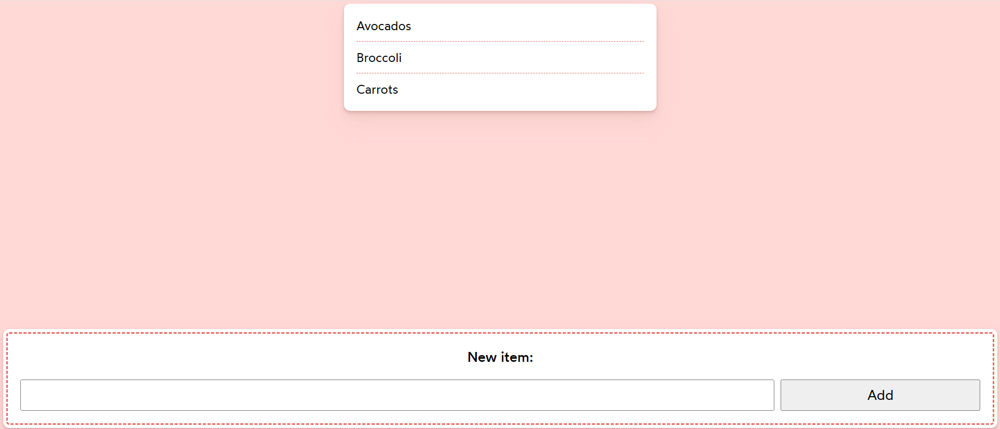
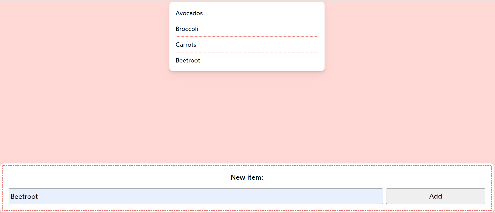

# State Lifting

In React, `State Lifting` refers to a pattern or technique where state is managed in a higher-level component and passed down to lower-level components as props. This allows multiple components to share and synchronize the same state, ensuring consistency across the application.

By lifting state up to a common ancestor component, React ensures that changes propagate down to child components as props, maintaining a single source of truth for the shared state.

### Benefits of State Lifting:

1. Better code organization,
2. Improves data flow management, and
3. Enhances application performance by minimizing unnecessary re-renders.

## Example : Search Form

## Example : Canadian Dollar

## Example : Add List Item

