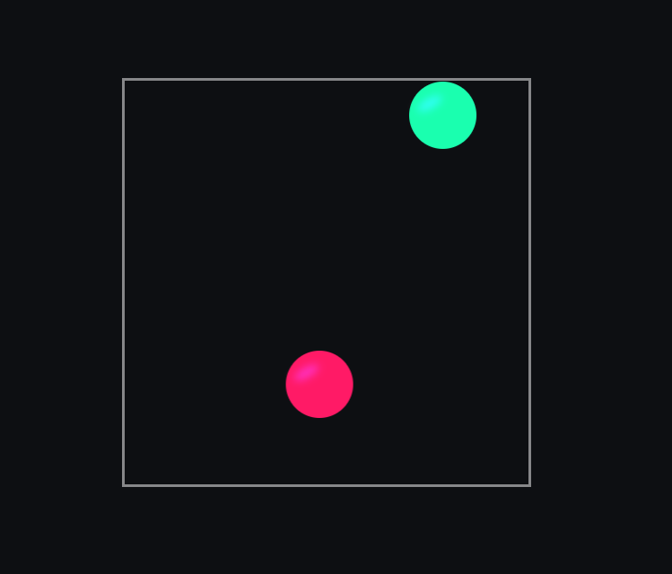
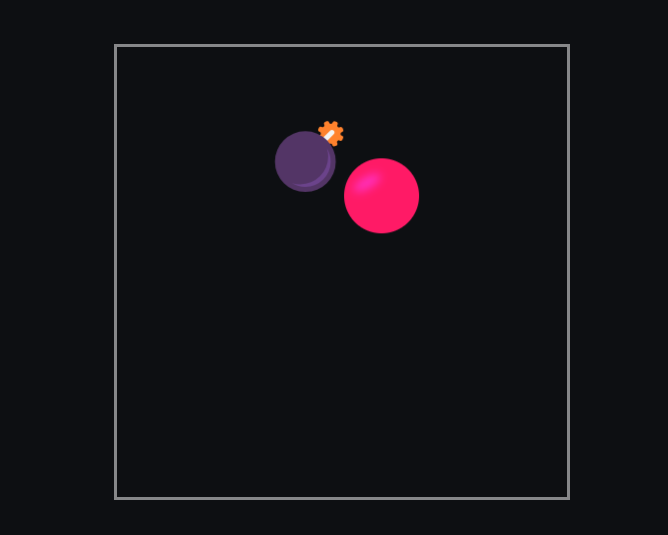

<h1>Use of functions</h1>
<h3>Your mission : </h3>
<h4>explore calling functions.</h4>

<h1>Function Parameter</h1>
<h3>Your mission : </h3>
<h4>passing arguents to functions. On click of ball passing "win" as an argument </h4>

