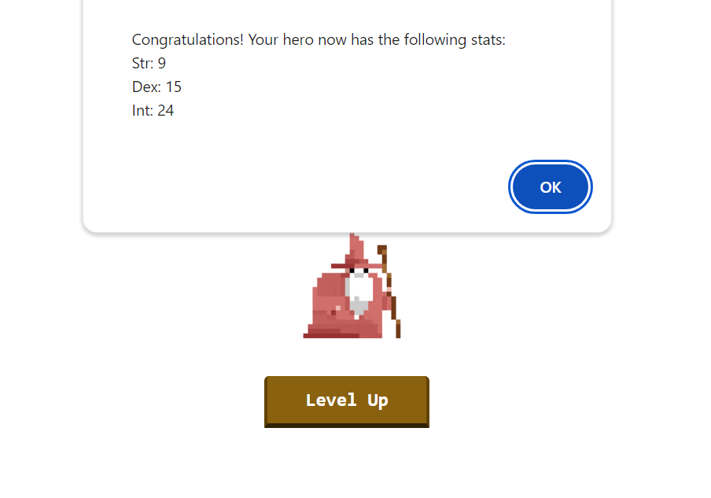
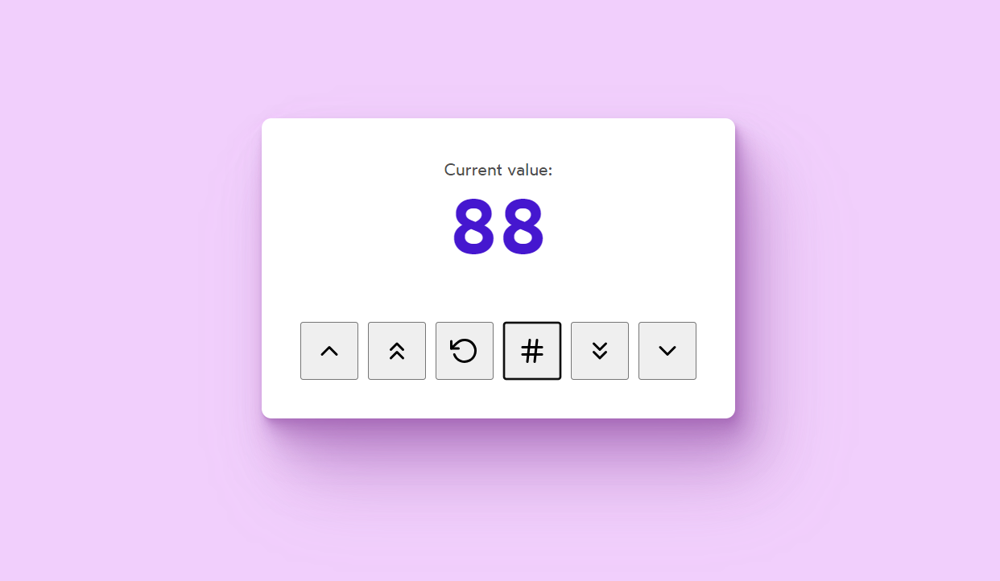

<h1>Asynchronous Updates</h1>
<h3>Your mission : </h3>
<h4>Intro to state variables. (React handles state updates asynchronously rather than synchronous
)</h4>

<h1>Counter App</h1>
<h3>Your mission : </h3>
<h4> Create a counter app to add, subtract and generate random number. </h4>

