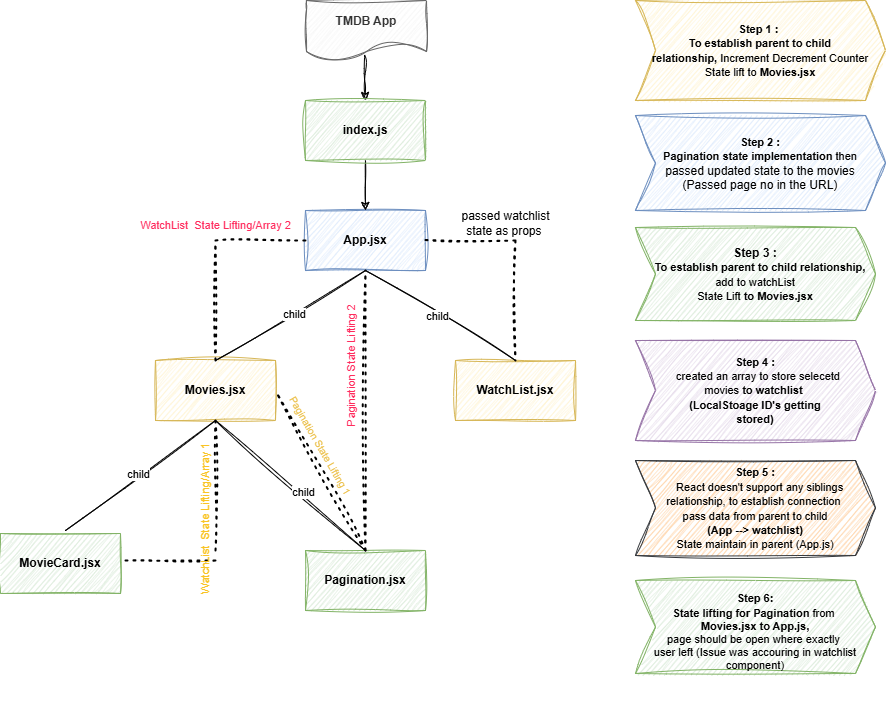
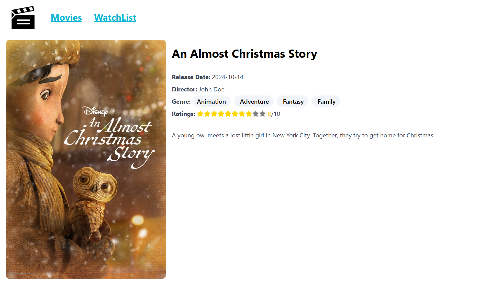
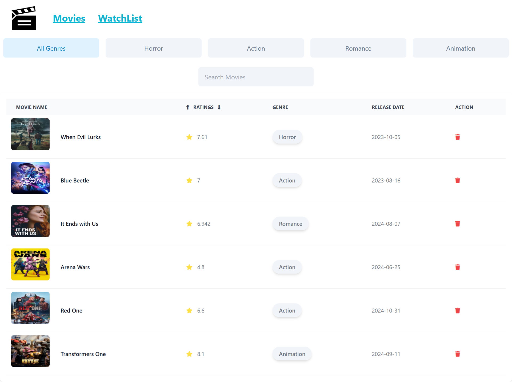

# TMDB Movie App

This is a React-based movie application that integrates with the TMDB (The Movie Database) API to fetch trending movies and display them on the home page. The app allows users to save movie details to localStorage, manage a watchlist, and filter movies by genre. Here’s a breakdown of the features:

## Key Features:

**Trending Movies**: Displays a list of trending movies fetched from the TMDB API. 
**Movie Detail Page**: Each movie in the trending list links to a detailed view page, showing additional information such as the movie’s plot, cast, and more. 
**Watchlist Component**: Users can save their favorite movies to the watchlist, which is stored in localStorage for persistence across sessions. 
**Movie Filtering**: The watchlist component supports filtering by genre to make it easier to browse saved movies. 
**LocalStorage Integration**: All watchlist data is stored in localStorage to maintain the user's data even after they leave or refresh the page. 
**Pagination**: Enables smooth navigation by dividing the list of trending movies into pages, displaying 20 movies per page. Users can easily move between pages using "Next" and "Previous" buttons, ensuring a user-friendly browsing experience and optimized performance.

## Technologies Used:

1. React.js for frontend development
2. TMDB API for fetching movie data
3. localStorage for saving movie data
4. React Router for navigation between pages
5. CSS/Tailwind for styling

# Low Level Design Overview

# Screen Captures

### Home Page

### Movie Detail

### WatchList

