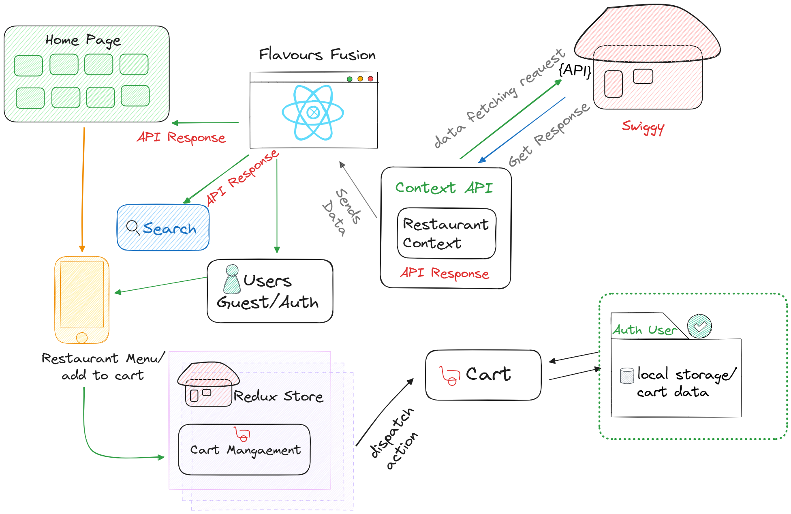

# Swiggy Clone App - React JS ⚛️

This project is a Swiggy Clone built with React JS, designed to replicate key features of Swiggy's food delivery platform with modern web development practices.

## High-Level Design (HLD) Diagram

The following diagram illustrates the high-level architecture of the Swiggy clone app:



## Folder Structure 🗂️

```
src/
├── Components/
│ ├── authentication/
│ │ ├── SignInPage.js
│ │ └── SignUpPage.js
│ ├── cart/
│ │ ├── Cart.js
│ │ └── CartList.js
│ ├── common/
│ │ ├── Error.js
│ │ ├── Footer.js
│ │ ├── Header.js
│ │ ├── Modal.js
│ │ └── ScrollToTop.js
│ ├── restaurant/
│ │ ├── ItemList.js
│ │ ├── RestaurantCategory.js
│ │ ├── RestaurantCard.js
│ │ ├── RestaurantMenu.js
│ │ └── Search.js
│ └── Body.js
│ └── Shimmer.js
├── utils/
│ ├── context/
│ │ ├── RestaurantContext.js
│ │ └── userContext.js
│ ├── hooks/
│ │ └── useRestaurantMenu.js
│ ├── store/
│ │ ├── appStore.js
│ │ └── cartSlice.js
│ ├── constants.js
│ ├── mockData.js
```

It includes dynamic features like:

## Features

### 1. Home Page 🍽️

- **Dynamic Data Fetching**: Retrieves live restaurant data using Swiggy's API.
- **User Location Based Display**: Displays restaurants based on user location, with a default fallback location.
- **Smooth Loading Experience**: Shimmer UI implemented for a seamless loading experience.
- **UI design**: Tailwind CSS used for styling

### 2. Search Functionality 🔍

- **Efficient Search**: Users can search for restaurants.
- **Performance Optimization**: Debouncing technique applied for better performance and fewer API calls during searches.
- **Search History**: Last 5 searches are saved in localStorage for user convenience.

### 3. Authentication 🔐

- **Sign In / Sign Up**: Forms built using react-hook-form for efficient form management.
- **Guest User Experience**: Guest users can browse and add items to the cart, but their data is not stored in localStorage.

### 4. Context API for Global State 📌

- **Data Fetching**: A shared component fetches data for both the Home and Search pages.
- **User Details Display**: The logged-in user's details are displayed using the Context API for global state management.

### 5. Restaurant Menu Page 📋

- **Menu Display**: Each restaurant's menu is displayed with detailed item options.
- **Cart Functionality**: Users can add multiple items to the cart from the same restaurant.

### 6. Cart Management with Redux 🛒

- **State Management**: The cart state is handled via Redux, allowing users to easily manage their orders.
- **Restaurant Switching functionality**: If a user tries to add items from a different restaurant, a prompt ensures they wish to reset the cart before proceeding.
- **Persistent Data for Logged-In Users**: Cart data is saved in localStorage for returning logged-in users.
- Guest users can add items to the cart for viewing but do not store data in `localStorage`.

### 7. Cart Page 📝💵

- **Order Overview**: Displays added items and restaurant details.
- **Modify Orders**: Users can remove items from the cart, and changes are reflected in both the Redux state and localStorage.
- **Seamless Navigation**: Provides a link back to the restaurant menu for easy modification of orders.

## Technology Stack </>🖥️

- **React JS**: Core frontend framework.
- **Redux**: For managing cart state.
- **Context API**: For global state management (e.g., user data).
- **react-hook-form**: For managing forms (Sign In / Sign Up).
- **Tailwind CSS**: For styling and responsive design.
- **LocalStorage**: Used for maintaining cart and search history.
- **Debouncing**: Implemented for Search functionality to optimize performance.
- **Intl API**: Used for dynamic currency formatting based on browser language.
